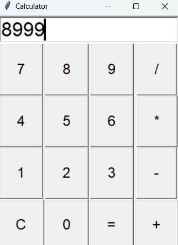
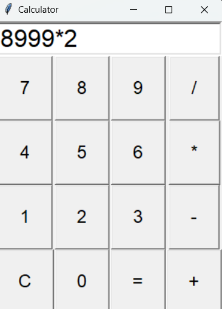
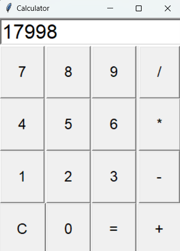

# Tkinter Calculator

This is a basic calculator application built with Python's Tkinter library. It provides a graphical user interface (GUI) for performing basic arithmetic operations, including addition, subtraction, multiplication, and division.

## Features

- Simple and intuitive interface.
- Performs basic arithmetic operations.
- Supports clear functionality to reset the input.
- Evaluates expressions and handles errors gracefully.

## How to Run

1. Ensure you have Python installed on your machine.
2. Clone or download this repository.
3. Navigate to the project directory in your terminal or command prompt.
4. Run the application using the following command:

    ```bash
    python CalciUsingTKinter.py
    ```

## Usage

- **Buttons:** Click on the buttons to enter numbers and operators.
- **Clear (C):** Clears the current input.
- **Equals (=):** Evaluates the entered expression and displays the result.
- **Operators:** Perform arithmetic operations like addition, subtraction, multiplication, and division.

## Example

Here's a screenshot of the calculator in action:







## Acknowledgements

- Thanks to Python and Tkinter for providing a simple way to create GUI applications.
- Inspired by various Python programming tutorials and resources.
